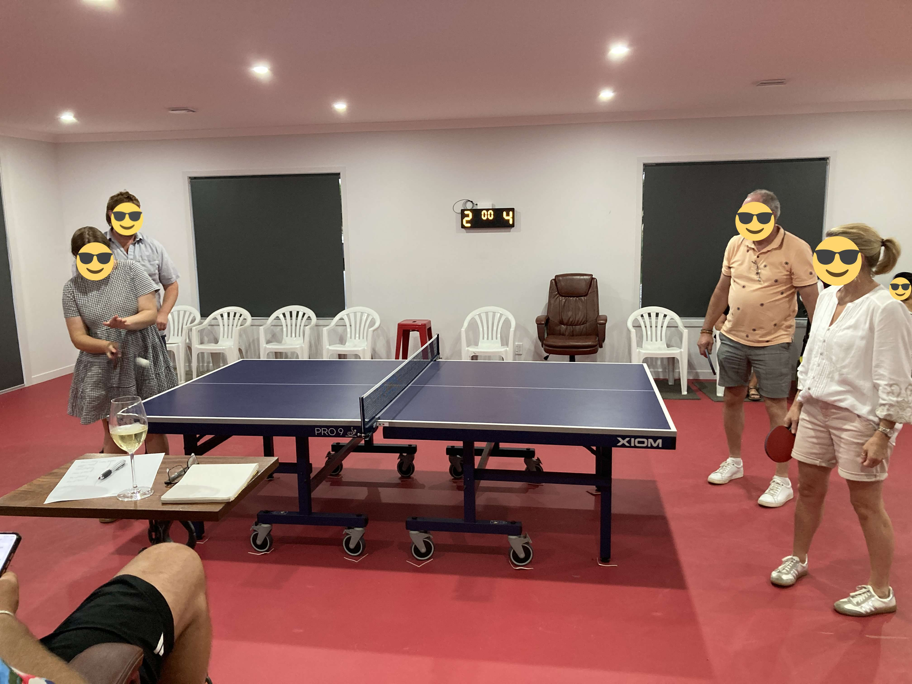

# Table tennis scoreboard
Hardware and software design for an electronic table tennis score board.

## Features
This device has the following characteristics:
- Keeps track of scores, number of games, and timeouts.
- Remotely controlled using Wi-Fi and a web server.
- A mechanical design which is mainly based on laser-cut parts.
- WS2813 LEDs: adjustable screen colour and brightness.
- Software runs on an ESP32-S3.

## Building it
Mechanical parts are laser-cut from sheet material. An overview of individual parts:
- [Perspex Frost Midnight Black 9221, 3 mm thickness](https://www.laserbeest.nl/materialen/acrylaat-zwart-frost-3mm/)
  - ``front.svg``
  - ``back.svg``
  - ``wall-side-no-holes.svg``
  - ``wall-side-with-holes.svg``
  - ``wall-top-bottom.svg``
- [Perspex Frost Slate Grey 9T23, 3 mm thickness](https://www.laserbeest.nl/materialen/acrylaat-frost-donkergrijs-3-mm/)
  - ``diffuser-major.svg``
  - ``diffuser-minor.svg``
  - ``diffuser-timeout.svg``
- [PE rigid foam, 20 mm thickness](https://snijlab.nl/en/products/pe-rigid-foam?variant=48708138500423)
  - ``lightbox.svg``

Production files have also been prepared which can be sent to Dutch lasercutting companies as-is:
 - ``mechanical/production/production-laserbeest.pdf``
 - ``mechanical/production/production-snijlab.pdf``

The following additional parts are required to assemble the enclosure:
- 50x ISO7380 screw, M3x10.
- 15x M3x50 standoff, fully threaded, black ([example](https://www.aliexpress.com/item/1005004063804402.html)).
- 15x M3x20 standoff, fully threaded ([example](https://www.aliexpress.com/item/4000152799825.html)).
- USB type C extension cable ([example](https://www.aliexpress.com/item/1005005446667716.html)).
- Cyanoacrylate glue to join the frosted diffusers to the front plate.

